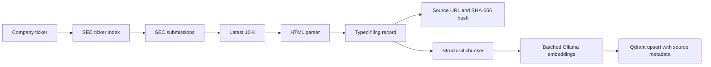

# Due Diligence

[](https://github.com/GSmith2427/due-diligence/actions/workflows/ci.yml)

An in-progress Python project for collecting public-company filings with verifiable source provenance and connecting local AI and vector-search services.

> **Project status:** Infrastructure prototype under active development. SEC collection, structural text chunking, batched embedding and Qdrant indexing are implemented. Automated report generation, hybrid retrieval and the command-line workflow remain on the roadmap.

## Implemented capabilities

- Resolve company tickers to SEC Central Index Keys (CIKs)
- Find and retrieve a company's latest 10-K filing from SEC EDGAR
- Extract readable text and tables from filing HTML
- Attach the source URL, retrieval time and SHA-256 content hash to every filing
- Communicate asynchronously with local Ollama and Qdrant services
- Split filing text into overlapping chunks using structural separators and approximate token counts
- Request embeddings in batches of up to 32 chunks and upsert vector records to Qdrant
- Use deterministic chunk IDs for repeat ingestion of identical input
- Store source URLs, filing identifiers and chunk text alongside vectors
- Create and validate dense-vector collections in Qdrant
- Validate typed configuration loaded from environment variables
- Test HTTP behaviour without calling live services by using mocked transports

## Current architecture



The ingestion pipeline accepts a Filing record and coordinates chunking, embedding and indexing. The caller must initialise the Qdrant collection. A user-facing ticker-to-report application is still on the roadmap.

## Technology

- Python 3.13
- httpx and async HTTP
- Pydantic and pydantic-settings
- Beautiful Soup and tiktoken
- Ollama
- Qdrant
- pytest, Ruff and mypy
- uv and Docker Compose

## Development setup

### Requirements

- Python 3.13
- [uv](https://docs.astral.sh/uv/)
- Docker, if running Qdrant integration tests
- Ollama, if running Ollama integration tests

Clone the repository and install its dependencies:

```bash
git clone https://github.com/GSmith2427/due-diligence.git
cd due-diligence
uv sync --frozen
```

The unit tests do not require Ollama or Qdrant:

```bash
uv run pytest -m "not integration"
```

On revision `91bb7fa`, 37 unit tests passed locally on 5 September 2026 with **89% combined statement and branch coverage**. Ruff lint, formatting and mypy also passed. Verification used a clean source snapshot and the existing Python 3.13.13 project environment; a fresh dependency installation and live services were not tested. The three service-dependent tests were excluded.

The chunker uses tiktoken, which may need to download its encoding data on first use.

Run the quality checks with:

```bash
uv run ruff check .
uv run ruff format --check .
uv run mypy
```

To start Qdrant locally:

```bash
docker compose up -d
```

## Configuration

Settings use the `DD_` prefix and double underscores for nested fields. For example:

```dotenv
DD_ENVIRONMENT=development
DD_LOG_LEVEL=INFO
DD_SEC_EDGAR__USER_AGENT="due-diligence your-email@example.com"
DD_OLLAMA__HOST=http://localhost:11434
DD_OLLAMA__CHAT_MODEL=qwen2.5:14b-instruct
DD_OLLAMA__EMBEDDING_MODEL=bge-m3:latest
DD_QDRANT__HOST=http://localhost:6333
DD_QDRANT__COLLECTION_NAME=filings
DD_QDRANT__VECTOR_SIZE=1024
```

Store local values in an untracked `.env` file. Do not commit contact details or credentials.

## Roadmap

- Add a working command-line entry point
- Make overlapping chunk offsets exact and enforce token limits for unbroken/Unicode text
- Define cleanup of old vectors when re-chunking a previously indexed filing
- Implement and evaluate hybrid retrieval and reranking
- Produce a small, cited report from a company ticker
- Add broader integration coverage and reproducible retrieval evaluation
- Document the completed architecture and operational limits

## Design decisions

The repository includes architecture decision records covering leadership data sources and the local runtime topology under [`docs/adr`](docs/adr).

## Limitations

- SEC source collection currently covers 10-K filings
- Overlap reconstruction can produce offsets that do not match the source substring
- Character-based fallback splitting can exceed the configured token maximum
- Changed chunk text or settings produce new IDs; old vectors are not automatically removed
- Token counts use a proxy tokenizer rather than the embedding model tokenizer
- The repository does not yet generate an investment or due-diligence report
- Ollama and Qdrant integration tests require locally running services
- Generated analysis will require independent verification against primary sources

This project is an engineering and research exercise and does not provide investment advice.

## License

MIT
